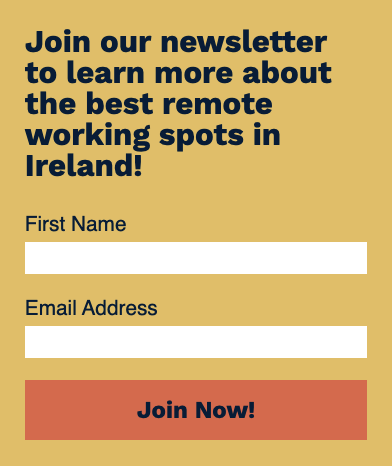

# Remote/Guide

  

## Table of Contents
* [Purpose](#Purpose)
* [Features](#Features)
* [Future Features](#features-to-implement-in-the-future)
* [Wireframes](#wireframes)
* [Technologies Used](#Technologies-Used)
* [Testing](#Testing)
* [Validation Testing](#validation-testing)
* [Deployment](#deployment)
* [Credits](#credits)
* [Acknowledgements](#acknowledgements)
* [Note on Commit History](#note-on-commit-history)

## Purpose

The purpose of the Remote/Guide site is to provide people with information on places in Ireland suitable for remote working. These places are ranked by criteria such as the cost of renting or buying a house, the rate of crime and the amenities available. Each listing provides direct links on where to rent or buy accommodation for the area.

There is also a list of useful products for someone who wants to work from home, with links on where to purchase them. The user can sign up for a newsletter to learn more about remote working.

The site can be viewed [here](https://neil314159.github.io/portfolio-project-1/).

## Features

* Navigation Bar 
    * This provides links to the home page, the resource page and the newsletter signup page, allowing the user to easily navigate their way to each section. This is a clear, simple menu present on every page so the user can be confident in finding their way around the site.

    

* Header Image
    * The large header image on the home page shows a man working at a computer in a home office. There is a text overlay providing the title of the site. The picture and title captures the interest of the user and provides context about the theme and function of the site.

    

* Introduction & Statistics
    * Here the user can see the purpose of the site and the type of information available. In this case, the best places to work from home in Ireland are ranked in a list. They are also provided with background information on changing attitudes to remote working. 

    

* Results
    * This is a list of 5 places in Ireland ranked by how suitable they are for working from home. Each place has a card showing a picture of the area as well as information such as the cost of renting or buying a property. There are direct links provided to useful websites if the user wishes to search for property in the area. 

    

* Resource Page
    * Here the user can see a gallery page with useful products for working from home. They can view pictures of the product, as well as clicking links to be presented with options on where to buy them. These links open in a new tab.

    

* Signup
    * On this page, the user is presented with a form where they can sign up to a newsletter about remote working. This gives the user the option of learning more and staying up to date if they are interested in this topic.

* Footer
    * The interactive footer with a hover effect is present on the bottom of all pages, and gives easy access to the social media pages of the site. These links open in a new tab.

    

* Favicon & 404 Page
    * The favicon allows the user to easily locate the tab for the site, and the 404 page will redirect them if they mis-type the address.

### Features to implement in the future
* Add an embedded Google Maps view of the locations shown in the guide, to help the user visualise the geography and distances involved in moving house
* Replace CSS colours and fonts with variable names. This will make it easier to change the visual style of the site and keep it up to date
* Make the newsletter signup form link to a functional backend providing an email response.

## Wireframes
 
 
 

## Technologies Used
* HTML 
    * The structure and contents of the website were created using the HTML language.
* CSS 
    * The CSS language was used for styling and layout of the site.
* [Font Awesome](https://fontawesome.com) 
    * FontAwesome icons were used for the social media links in the footer and to accompany the information provided for each city.
* [Google Fonts](https://fonts.google.com/)
	* Google Fonts was used to generate the CSS codes to import the 'Work Sans' and 'Bitter' fonts used for the headings and text.
* [FontPair](https://www.fontpair.co)
    * FontPair was used to explore and evaluate different combinations of fonts.
* [Github](https://github.com) 
    * GitHub is used to host the source code of the site.
* [Git Pages](https://pages.github.com)
    * Git Pages is the platform upon which the site is deployed.
* [Gitpod](https://gitpod.io) 
    * Gitpod was used as a development environment and pushed code to Github for storage and deployment.
* [Balsamiq](https://balsamiq.com/wireframes/)
	* Balsamiq was used to explore initial designs for the site and develop wireframe models of the layout.
* [Coolers CSS Pallette Generator](https://coolors.co)
    * Coolers was used to generate and compare colour pallettes to make sure the site had matching colour tones.
* [MacOS Preview](https://support.apple.com/guide/preview/welcome/mac)
    * Preview was used to resize and crop images for use on the site.
* [Favicon](https://favicon.io/) 
    * was used to generate and download the favicon for the website.
* [Lighthouse](https://developers.google.com/web/tools/lighthouse#devtools) 
    * Lighthouse provided a report pointing out problems with speed and accessibility. 
* [Google Chrome Developer Tools](https://developers.google.com/web/tools/chrome-devtools) 
    * Chrome Developer Tools were invaluable to help diagnose layout errors.
* [Wave Web Accessibility Tool](https://wave.webaim.org) 
    * The Wave Tool provided a detailed report on the level of accessibility of the site.

## Testing

* Test how responsive the website is on different browsers and screen sizes.
    * Test:
        1. Select a test suite of browsers (Chrome, Safari, Firefox).
        1. Open the dev tools on each browser and inspect the site at a variety of resolutions, from widescreen monitor down to legacy mobile devices (2000px down to 300px).
        1. Verify that the layout, appearance and functionality of the site is maintained at each resolution.
        1. By manually altering the screen size up and down check the breakpoints are operating correctly and the content scales in a smooth and responsive manner.
    * Result:
        * The site behaved responsively across all browsers and screen sizes.

* Test that the site works as expected on a physical mobile device.
    * Test:
        1. Using an iPhone XR, open the browser and navigate to the site.
        1. Click each page, menu option and link to verify they work correctly. Also visually verify that the layout of the site is maintained on a mobile device.
    * Result:
        * On a physical mobile device, all links, menu options and layout were operating as expected.

* Click the links in the navigation bar to ensure they go to the correct page.
    * Test:
        1. Open the browser and navigate to the website.
        1. Click each of the three navigation links in the menu bar (Home, Resources and Newsletter).
    * Result:
        * All links work correctly and send the user to the right page.

* Test that the social media links in the footer work correctly.
    * Test:
        1. Open the browser and navigate to the website.
        1. Click each link in the footer and verify that they open in a new tab to the correct social media page: Youtube, Facebook, Instagram and Twitter.
    * Result:
        * Each of the footer links operated correctly and opened the appropriate page in a new tab.

* Test that navigation menu and footer links light up when the user hovers over them.
    * Test:
        1. Open the browser and navigate to the website.
        1. Hover over each link in the navigation menu at the top of the screen and the footer menu at the bottom and confirm that they change colour when the pointer moves over them.
    * Result:
        * The two sets of links changed colour when hovered over using the mouse.

* Test that the navigation bar shows the current page by underlining it.
    * Test:
        1. Open the browser and navigate to the website.
        1. Click on each of the three links in the navigation menu and verify that the current page is highlighted by an underline on its entry in the menu.
    * Result:
        * Each page was correctly highlighted in the menu when the page is currently selected.
                
* Validate the inputs on the newsletter signup form.
    * Test:
        1. Start the browser, go to the website address and select the Newsletter tab in the navigation bar.
        1. Enter text into the fields in the form, leaving different fields blank or using an incorrectly formed email address. 
    * Result: 
        * The form will not allow the user to submit it until each input field is filled in correctly. This confirms the inputs are being validated properly.

### Validation Testing
* HTML: All pages in the site were tested using the [W3C Validator](https://validator.w3.org/nu/?doc=https%3A%2F%2Fneil314159.github.io%2Fportfolio-project-1%2Findex.html). On the newsletter signup page I received a warning about a stray div tag which was then fixed. All other pages were passed showing no problems.
* CSS: The CSS file was tested using the [W3C Jigsaw](jigsaw.w3.org) validator. This showed an extra hash mark in one of the number codes, which was then removed.
* Accessibility: the site was examined using the Google Lighthouse suite in Chrome and the [Wave](https://wave.webaim.org/report#/https://neil314159.github.io/portfolio-project-1/index.html) accessibilty checker. This showed up one issue, which was the light text on an orange background for some buttons had a poor contrast ratio. The text was made darker and the issue was resolved.

### Unfixed Bugs

No other bugs were found during my testing.

## Deployment

### Project Set-up
The Code Institure template found [here](https://github.com/Code-Institute-Org/gitpod-full-template) was used. This template was pre-configured with useful extensions and allowed me to get the project up and running quickly. I selected a repository name and used Gitpod to start editing my project files.

The Remote/Guide website was deployed to GitHub Pages by following these steps:
1. Navigate to the [Project 1 portfolio](https://github.com/neil314159/portfolio-project-1) on GitHub.
1. Click on the 'Settings' tab.
1. Select 'Pages' from the menu on the left. 
1. Select the 'main' branch in the source selector drop-down.
1. Click 'Save'.
1. After a few moments the website was deployed, and can be accessed here: https://neil314159.github.io/portfolio-project-1/

## Credits

### Content

The written text on the main page was created by myself.

The numerical data used was from [Switcher](https://www.switcher.ie).

### Media

All pictures were taken from [Unsplash](www.unsplash.com) and [Pixabay](www.pixabay.com).

### Code

The CSS clamp technique to vary text size without media queries and remain proportional to the screen size was used after watching Kevin Powell's Youtube channel found [here](https://www.youtube.com/kepowob/videos).

### Acknowledgements
Thanks to Daisy McGirr for her advice and guidance.

# Note on commit history
There was a brief period during this project where Gitpod was offline, so I used my own local copy of VS Code on my laptop. When I linked to Github and made my commits it did not authenticate them properly, and so it can appear that another user was making commits. I have contacted Student Care and one of the online tutors about this, who recommended including this explanation. If you have any concerns I can be contacted about this.